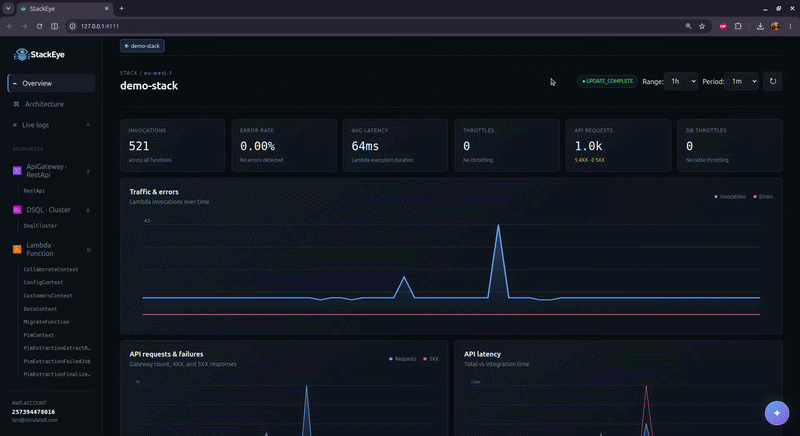

# StackEye

A focused, zero-configuration local observability dashboard for deployed AWS SAM and AWS CDK stacks. It discovers a SAM template or synthesized CDK cloud assembly, resolves the stack's physical resources through CloudFormation, and shows metrics, architecture, logs, and resource workbenches in a polished local web app.



## Install globally

```bash
npm install -g stackeye
stackeye
```

Run `stackeye` from a SAM or CDK project directory. StackEye opens its local dashboard at `http://127.0.0.1:4111`.

### Develop StackEye against another project

Link the StackEye checkout once, then run its linked binary from the SAM or CDK project you use for testing:

```bash
# In the StackEye repository (once)
npm link

# In the SAM or CDK project
stackeye --watch
```

There is no need to run `npm pack` again. Changes under `src/` and `bin/` restart the local server automatically; changes under `public/` are served directly with caching disabled, so a browser refresh picks them up. Run `npm unlink -g stackeye` when you no longer want the global development link.

## Use it in a SAM project

```bash
npm install --save-dev stackeye
npm pkg set scripts.stackeye="stackeye"
npm run stackeye
```

Or run it without installing:

```bash
npx stackeye
```

For SAM projects, the current folder must contain `template.yaml`, `template.yml`, `sam.yaml`, or `sam.yml`. The deployed stack name and region are read from `samconfig.toml`. They can also be supplied explicitly:

```bash
npx stackeye --stack my-stack --region eu-north-1 --profile dev
```

## Use it in a CDK project

Synthesize the app, then run StackEye from the CDK project root:

```bash
npx cdk synth
npx stackeye
```

StackEye reads `cdk.out/manifest.json`, selects its CloudFormation stack artifact, and uses the synthesized template to build the resource and architecture views. If the cloud assembly contains multiple stacks, select the deployed stack with `--stack`:

```bash
npx stackeye --stack MyApplicationStack
```

You can also point directly at any synthesized CloudFormation JSON or YAML template with `--template`; when doing so, pass `--stack` if its deployed stack name cannot be inferred from the containing folder.

When `samconfig.toml` contains multiple environments (for example `default`, `staging`, and `production`), StackEye asks which one to use before connecting to AWS. For non-interactive use, select it explicitly:

```bash
npm run stackeye -- --config staging
```

Global and deploy parameters from the selected environment are merged, including `stack_name`, `region`, and `profile`. Explicit `--stack`, `--region`, and `--profile` arguments take precedence. SSO profiles use the AWS SDK's standard SSO credential provider; if the cached session has expired, authenticate first with `aws sso login --profile <name>`.

The dashboard opens at `http://127.0.0.1:4111`. It only binds to localhost.

## What it includes

- Stack status, deployed resources, and physical IDs
- Lambda invocations, errors, error rate, duration, concurrency, and throttles
- Lambda traffic, failure rate, concurrency, throttling, latency, workload ranking, async age, and dead-letter failures
- API Gateway request volume, 4XX/5XX failures, total latency, and integration latency
- DynamoDB read/write consumption, throttles, system/user errors, table health, and workload ranking
- Stack resource composition, outputs, deployment state, and physical identifiers
- CloudWatch log tailing with function selection and server-side filter patterns
- An operational resource navigator generated from the deployed stack, excluding infrastructure-only artifacts such as permissions, policies, generated API deployments, and DNS records
- Lambda test invocations with named JSON events saved locally in `.stackeye/payloads.json`
- DynamoDB schema-aware scan, primary/GSI query, and conditional update builders; single-table item-collection navigation; schema discovery; and tabular results
- A read-only SQL editor for Aurora DSQL clusters in the stack, with schema browsing, one-click table queries, primary-key hints, and typed result columns
- An ER diagram of any Aurora DSQL cluster, drawn from declared foreign keys where they exist and from inferred column-name references where they do not, since Aurora DSQL has no foreign key constraints
- S3 folder browsing, bucket-wide filename search, downloads, and private localhost previews for images, PDF, text/code, Word, Excel, and PowerPoint files
- Time-range selection and manual metric refresh
- AWS profile, credential chain, and region support
- A page-aware Bedrock assistant powered by the Converse API, using credentials from the active AWS profile
- Bedrock model selection, visible-page questions, and multimodal questions about the currently previewed S3 PDF or image
- Reviewable AI drafts for read-only Aurora DSQL queries and schema-aware DynamoDB scans and queries; drafts are never executed automatically

The active AWS identity needs `cloudformation:DescribeStacks`, `cloudformation:ListStackResources`, `cloudwatch:GetMetricData`, `logs:FilterLogEvents`, and `sts:GetCallerIdentity`. `apigateway:GET` is optional and lets StackEye resolve REST API names for API Gateway metrics. Workbench actions additionally require `lambda:InvokeFunction`, `lambda:GetFunctionConfiguration`, `lambda:UpdateFunctionConfiguration`, `lambda:ListEventSourceMappings`, `lambda:GetEventSourceMapping`, `states:DescribeStateMachine`, `states:TestState`, `dynamodb:DescribeTable`, `dynamodb:Scan`, `dynamodb:Query`, and `dynamodb:UpdateItem` for the stack resources you want to operate on. The S3 explorer requires `s3:ListBucket` and `s3:GetObject` on the stack buckets. The Aurora DSQL editor requires `dsql:DbConnectAdmin` on the cluster, or `dsql:DbConnect` when connecting as a custom database role with `--dsql-user`.

The assistant requires `bedrock:InvokeModel` for the selected model in the active region. Questions and visible page context are sent directly from the local StackEye process to Amazon Bedrock in your AWS account. When an S3 PDF or image is visible, StackEye reads at most 4.5 MB with the existing `s3:GetObject` permission and supplies the bytes to Converse. It does not upload the file to any third-party service. Additional Converse-compatible model IDs can be exposed in the selector with a comma-separated `STACKEYE_BEDROCK_MODELS` environment variable.

Saved Lambda payloads may contain application data. Add `.stackeye/` to the project's `.gitignore` if events should remain local. StackEye reads existing `.samo11y/payloads.json` files for migration compatibility.

## Options

Run `stackeye --help` for all options. Use `--no-open` in remote or containerized environments and `--port` to select another local port. Use `--dsql-user` to connect to Aurora DSQL as a database role other than `admin`; the role must be mapped to the active IAM identity.

## Pricing

Standard AWS fees apply for the AWS services and resources used by StackEye.

## Security

AWS credentials remain in the Node process. They are never sent to the browser; the browser only talks to the localhost server. Log messages and metrics are not persisted.

Lambda invocations, Step Functions Task-state tests, and DynamoDB writes can affect the deployed stack. `TestState` does not create a state-machine execution, but a Task state can invoke its configured AWS service. DynamoDB updates require an explicit browser confirmation, are limited to tables discovered in the selected stack, and return the updated item. Scans and queries are capped at 250 items per request.

The Aurora DSQL editor is read-only in two independent ways. Every statement runs inside a `BEGIN READ ONLY` transaction that is always rolled back, so the database itself rejects any write the query attempts. Before that, StackEye accepts only a single `SELECT`, `WITH`, `TABLE`, `VALUES`, `SHOW`, or `EXPLAIN` statement, rejects statement batches, and rejects data-modifying CTEs — string literals and comments are excluded from that check, so ordinary queries are never blocked by their own data. Connections use IAM authentication tokens generated per request, are limited to clusters discovered in the selected stack, and return at most 1000 rows.

S3 previews are capped at 25 MB. Modern Office Open XML formats (`.docx`, `.xlsx`, and `.pptx`) are extracted locally into a readable text preview; files are never uploaded to a third-party viewer. Legacy binary Office formats (`.doc`, `.xls`, and `.ppt`) can be downloaded but are not rendered in the browser.
